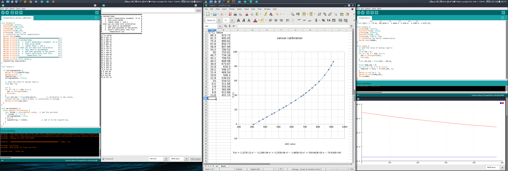

# Calibration
Follow the steps to calibrate the sensor:

1. Connect the sensor.
2. Connect the Arduino to the computer.
3. Upload the "sketch" CALIBRATION.ino
4. Open serial monitor (Ctrl+Shift+M)
5. Do the calibration.
6. Copy the data into spreadsheet.
7. Applay fitting curve to the data.
8. Ger the function equation to calculate the phisical quantity.

