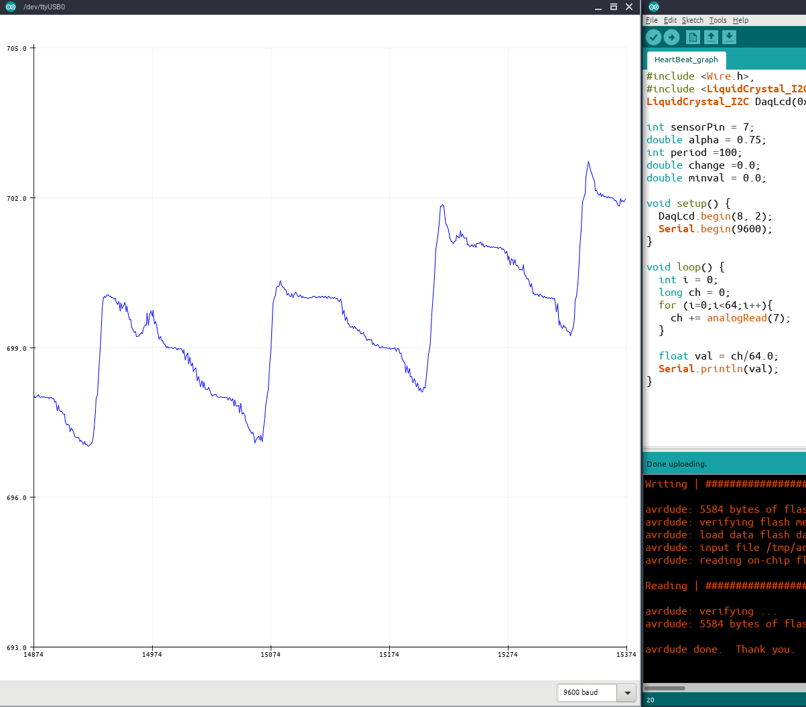

# Presentation of data with Arduino IDE
The data that are measured by Arduino board can be shown also in Arduino IDE (**I**ntegrated **D**evelopment **E**nvironment). Furthermore we have 2 options:
- in Serial Monitor or
- in Serial Plotter in graphical form.

In both cases we must use serial.print function:

    Serial.println(data1,data2,data3,... );

