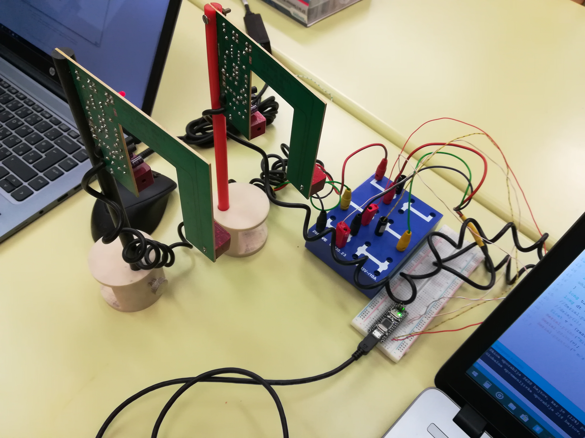

Author: Nejc Urbas, Matej Jerala

Date: 2018-03-22 

# Merjenje hitrosti izstrelka it topa

Program je namenjen meritvi hitrosti izstrelka iz balistiènega topa.

## Potrebna oprema

Za izvedbo eksperimenta potrebujemo:
+ Arduino nano
+ dvoja svetlobna vrata
+ balistièni top
## Navodila in uporaba

Arduino nano priklopite na svojo elektrièno vezavno plošèo. Nato oboja svetlobna vrata prikljuèite na napetost 5 V in GND. Tretja prikljuèka vrat pa prikljuèite na posamezni pin Arduina (spodaj sta to pina 14 in 15):

| Arduino prikljuèek  | senzor prikljuèek |
|:-------------------:|:-----------------:|
| +5V                 | VCC               |
| GND                 | GND               |
| 14                  | Signal prvih vrat |
| 15                  | Signal drugih vrat|

Za izvedbo eksperimenta zaènite svojo meritev in izstrelite kroglo skozi svetlobna vrata. Program pa vam bo izpisal hitrost.



## Program

 ```c++
#define prekinjeno 1		
#define prozorno 0
#define razdalja 100.000 	
void setup() {			
  pinMode(14, INPUT);	
  pinMode(15, INPUT);
  Serial.begin(9600);
```
Z #define nastavimo osnovne parametre (ali imajo svetlobna vrata ob prekinitvi logièno 1 ali logièno 0 in kolikšna je razdalja med svetlobnimi vrati. pinMode pa nam pove, na katera pina sta priklopljeni svetlobni vrati.
```c++
void loop() {
  while (digitalRead (14) == prozorno) {
  }
  long t1 = micros();
  Serial.begin(9600);
}
```
Ko prekinemo svetlobni snop, si program zapomni èas.

```c++
while (digitalRead (15) == prozorno) {
  }
  long t2 = micros(); //mikrosekunde
```
Ko prekinemo svetlobni tok, si program zapomni èas.

```c++
 long dt = t2 - t1;
  float v = (razdalja / dt) * 1000;
  Serial.print("Hitrost: ");
  Serial.print(v);
  Serial.println(" m/s");
```
Program odšteje èas t2 od t1. Izraèunamo hitrost in nam le to izpiše na zaslonu na serijskem vmesniku.

