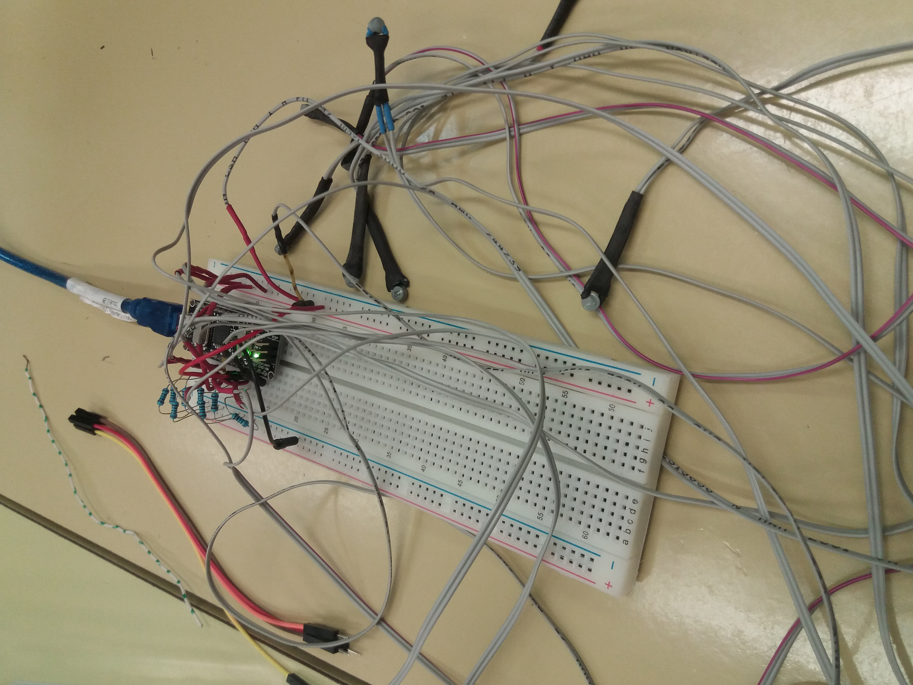

Author: Luka kukovica, Max Resnik

Date: 2018-03-22 
# Umeritev NTC termistorjev

S pomoèjo mikrokrmilnika Arduino nano bomo umerili 8 NTC termistorjev naenkrat. 

## Potrebna oprema

Za meritev potrebujemo mikrokrmilnik Arduino nano, 8 NTC termistorjev, raèunalnik, 8 1k Ohmskih upornikov ter naèin za primerjanje razliènih temperatur (posoda z vroèo vodo). Koda, ki jo vnesemo v program prilagava spodaj. 
+ Arduino nano ali uno [link](https://www.aliexpress.com/item/Nano-CH340-ATmega328P-MicroUSB-Compatible-for-Arduino-Nano-V3/32572612009.html)
+ NTC termistorji [link](https://www.sparkfun.com/products/250)

## Navodila in uporaba

Mikrokrmilnik Arduino nano prikljuèimo na raèunalnik. Na sam Arduino vežemo vseh 8 NTC termistorjev, tako kot je zapisano v spodnji tabeli.
Pri prikljuèku za signal lahko uporabimo katerikoli pin za digitalni vhod.

| Arduino prikljuèek  | senzor prikljuèek |
|:-------------------:|:-----------------:|
| +5V                 | VCC               |
| GND                 | GND               |
| A0                  | Signal            |
| A1                  | Signal            |
| A2                  | Signal            |
| A3                  | Signal            |
| A4                  | Signal            |
| A5                  | Signal            |
| A6                  | Signal            |
| A7                  | Signal            |

Meritve izvajamo tako, da izberemo lego NTC termistorjev in v raèunalnik vnesemo temperaturo na kateri naj bi termistorji bili. Raèunalnik nam vrne podatke v ADC enotah in Voltih. Meritve lahko poljubno ponavljamo.



## Program

```
String inputString = "";         // a String to hold incoming data
boolean stringComplete = false;  // whether the string is complete

void setup() {
  int pin_gnd = 16;
  int pin_vcc = 15;
  pinMode(pin_gnd, OUTPUT);
  pinMode(pin_vcc, OUTPUT);
  digitalWrite(pin_gnd, LOW);
  digitalWrite(pin_vcc, HIGH);
  // initialize the serial communication:
  Serial.begin(9600);
  Serial.println("###########################################");
  Serial.println("# INSTRUCTIONS:                           #");
  Serial.println("#   1. Insert temperature (example: 22.4) #");
  Serial.println("#   2. then press ENTER                   #");
  Serial.println("#   3. repeat steps 1. and 2. ...         #");
  Serial.println("# When you are done with calibration:     #");
  Serial.println("#   4. Copy data to spreadsheet.          #");
  Serial.println("#   5. Add some polynome to the points.   #");
  Serial.println("#   6. Insert coeficients into file:      #");
  Serial.println("#       'temperature.ino'                 #");
  Serial.println("###########################################");
  Serial.println("T[°C] Value");
  inputString.reserve(20);
}
```
Program nam s kodo loop ponavlja meritve tolikokrat kot želimo.

```void loop() {

  if (stringComplete) {
    Serial.print(inputString);
    Serial.print(" ");
    inputString = "";
    stringComplete = false;

    // send the value of analog input 0:
    long CH1 = 0;
```
Naslednji del kode nam omogoèa, da lahko meritev opravimo na vseh 8 termistorjih hkrati. Vsebuje vseh 8 Adruino prikljuèkov.

```    int j;
    for (j = 0; j < 8; j++) {
      int i;
      for (i = 0; i < 128; i++) {
        CH1 += analogRead(j);
        delay(1);
      }
```
Spodnja koda nam spremeni vrednosti v ADC enote in Volte ter jih izpiše na programu arduino. Podatke nam izpiše v decimalnem številu zaradi funkcije float.

```      float Vol_CH1 = float(CH1 / 128.0);        // calibration in ADC values...
      //float Vol_CH1 = CH1*5.0/1023; // calibration in Voltage...
      Serial.print(Vol_CH1);
      Serial.print(" ");
    }
    Serial.println();
  }
}

void serialEvent() {
  while (Serial.available()) {
    char inChar = (char)Serial.read();  // get the new byte:
    if (inChar == '\n') {
      stringComplete = true;
    } else {
      inputString += inChar;              // add it to the inputString:
    }
  }
}
```

##
Težava se je pojavila, ker le prva meritev dobi rezultat ADC enot med 0 in 1000, vse ostale imajo veèje številke.
