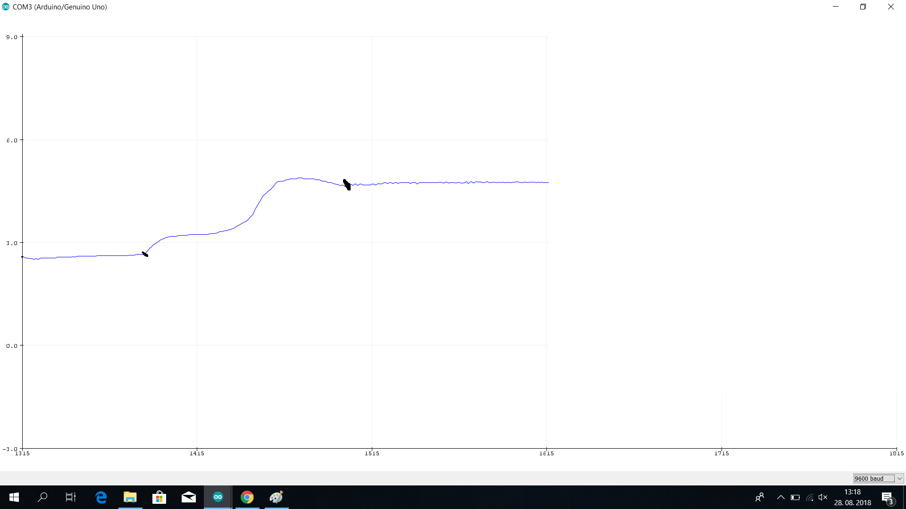

Autor:
Vesna Hribar 

Datum:
	2018-03-22

# Merjenje pH 

V Arduinu bom zapisala program za merjenje pH spojine. Najprej bom naredila umerite z pufrom. Pufer je snov z določenim pH-jem. Tudi če ji primešamo manjšo količino ali baze ali kisline, bo v vrednosti pH zanemarljiva. Za umeritev sem si izbrala pufer z pH vrednostjo 5. Pufri služijo tudi v industriji za umerjanje vseh naprav za merjenje pH.

## Potrebna oprema
- Arduino nano [link](https://store.arduino.cc/usa/arduino-nano)
- pH sonda [link](https://www.aliexpress.com/item/1Set-Liquid-PH-Value-Detection-Regulator-Sensor-Module-Monitoring-Control-Meter-Tester-BNC-PH-Electrode-Probe/32805675619.html?spm=2114.search0204.3.22.13d32410oYzaDc&ws_ab_test=searchweb0_0,searchweb201602_1_10065_10068_10059_10696_100031_10084_10083_5015611_10103_451_452_10618_10304_10307_10820_5016311_10301_10821,searchweb201603_56,ppcSwitch_5_ppcChannel&algo_expid=838596c6-3202-48a6-826d-749724071efc-3&algo_pvid=838596c6-3202-48a6-826d-749724071efc&transAbTest=ae803_2&priceBeautifyAB=0)

## Navodila za sestavo merilnega sistema

Senzor priključimo po tabeli:

| pH senzor | funkcija priključka | Arduino priključek |
|-----------|---------------------|--------------------|
| Do        | nastavitev meje     |                    |
| Po        | analogni signal     | A0                 |
| GND-AN    | analogni GND        | GND                |
| GND       | GND za napajanje    | GND                |
| V+        | Napajanje +5V       | +5V                |


## Program

```cpp
const int analogInPin = A0; 
int sensorValue = 0; 
unsigned long int avgValue; 
float b;
int buf[10],temp;
void setup() {
 Serial.begin(9600);
}
 
void loop() {
 for(int i=0;i<10;i++) 
 { 
  buf[i]=analogRead(analogInPin);
  delay(10);
 }
 for(int i=0;i<9;i++)
 {
  for(int j=i+1;j<10;j++)
  {
   if(buf[i]>buf[j])
   {
    temp=buf[i];
    buf[i]=buf[j];
    buf[j]=temp;
   }
  }
 }
 avgValue=0;
 for(int i=2;i<8;i++)
 avgValue+=buf[i];
 float pHVol=(float)avgValue*5.0/1024/6;
 float phValue = -5.70 * pHVol + 28.34;
 Serial.print("sensor = ");
 Serial.println(phValue);
 
 delay(20);
```

# Pričakovani rezultati in meritve

Trenda krivulja v tem primeru predstavlja spreminjanje pH vrednosti po dodajanju sode bikarbone k alkoholnemu kisu. Na začetku bom potopila elektrodo v alkoholni kis, nato bom dodajala sodo bikarbono. Alkoholni kis je kislina, kar pomeni da ima pH vrednost manj kot 7. Soda bikarbona je baza in ima pH vrednost več kot 7. Z mešanjem obeh snovi bo potekla kemijska reakcija nevtralizacije. 


