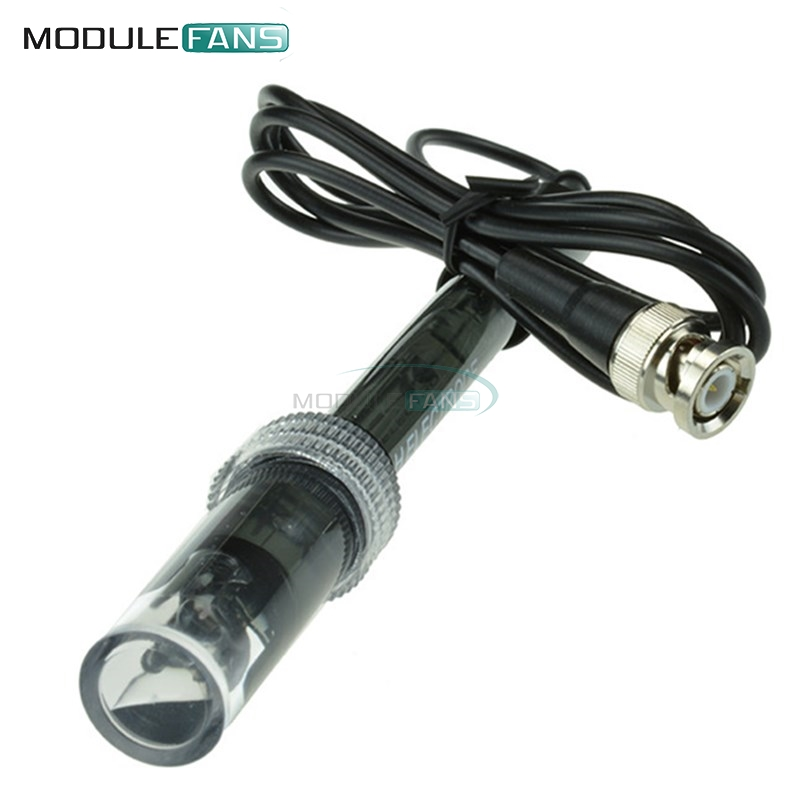

Author: Ime Priimek, Ime Priimek

Date: 2018-03-22 

# Naslov projekta

Ker bomo vse vaše projekte objavili na GitHub-u bomo tudi spremno besedilo napisali tako, kot je to v njihovi navadi v [markdown](https://github.com/adam-p/markdown-here/wiki/Markdown-Cheatsheet) načinu označevanja besedila... Če boste potrebovali posebej oblikovano besedilo si pomagajte z zgornjo povezavo a ne skrbite nekdo je rekel:

> All things are difficult before they become easy.

Pod glavnim naslovom napišite kratek opis projekta. Kaj je namen, kaj boste izmerili, za kaj bi to potrebovali... Žal GitHub ne podpira izpisa enačb, kot ga lahko najdemo v LaTex zapisu ampak le vrstične zapise z nad- in pod- pisom. Naprimer:

```math
s = v₀t₁ + ¹/₂at²     
```
## Podnaslov - Potrebna oprema

Seveda izbrišite besedo __Podnaslov__ v zgornjem podnaslovu... Na tem mestu naštejte katere potrebščine bi učitelj potreboval in jih naštejte (uporabljalte znake kot so: *, - ali +):
+ Arduino nano ali uno [link](https://www.aliexpress.com/item/Nano-CH340-ATmega328P-MicroUSB-Compatible-for-Arduino-Nano-V3/32572612009.html)
+ pH senzor [link](https://www.aliexpress.com/item/BNC-Electrode-Probe-Connector-Hydroponic-for-PH-Aquarium-Controller-Meter-Sensor/32380238251.html)

## Navodila in uporaba

V tem podnaslovu opišite kako naj učitelj postopa z opremo, kako naj stvari priključi... če potrebujete to prikazati v tabeli lahko enostavno to narišete z znaki takole:

| Arduino priključek  | senzor priključek |
|:-------------------:|:-----------------:|
| +5V                 | VCC               |
| GND                 | GND               |
| A0                  | Signal            |

Opišite tudi kako naj učitelj izvede meritev... Če potrebujete svoje besedilo dopolniti tudi s sliko, to lahko storite takole:



## Program

Na koncu dodajte programsko kodo, ki jo razčlenite in opišite njen pomen. Še posebno poudarite dele programske kode, ki so namenjeni ne-veščim uporabnikom, da lahko hitro prilagodijo izvajanje programa svojim potrebam.

Naprimer:
+ Kako lahko nastavijo število meritev?
+ Kako lahko nastavijo hitrost izvajanja meritev?
+ Kako lahko nastavijo priključek, ki ga merijo?

Program pišite v blok treh \` (opuščajev) takole:

 ```c++
s = "Da bo koda pravilno obarvana"
Serial.print(s);
```

Vmes med različnimi bloki programske kode pa komentirajte njihov pomen. Naprimer v naslednji kodi imamo funkcijo **setup()**, v kateri nastavimo vse pomembne izhodnje priključke (S0 .. S3) in en vhodni priključek (sensorOut). 

```c++
void setup() {
  pinMode(S0, OUTPUT);
  pinMode(S1, OUTPUT);
  pinMode(S2, OUTPUT);
  pinMode(S3, OUTPUT);
  pinMode(sensorOut, INPUT);
  
  // Setting frequency-scaling to 20%
  digitalWrite(S0,HIGH);
  digitalWrite(S1,LOW);
  
  Serial.begin(9600);
}
```

## V izdelavi...

Če vam katere od funkcionalnosti ne bo uspelo zagotovi jo prosim navedite tukaj in jo bo morada dokončal nekdo drug, ki bo naletel na vaš projekt...
