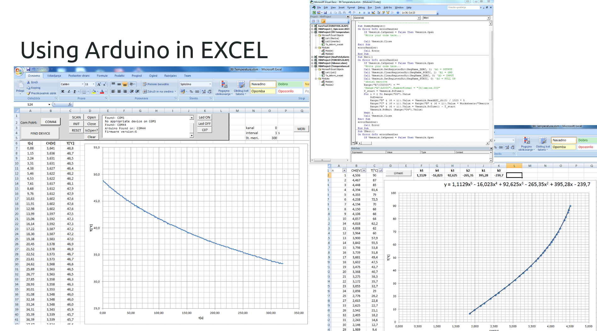

# Using Arduino DAQ from MicroSoft Office EXCEL
We can use Arduino as DAQ also from Microsoft Office EXCEL.
First, we must install all required DLLs and drivers. Next, we must upload Firmware-v06.hex on the Arduino board. This program is required for proper communication between Excel and Arduino board.
And last, we open prepared excel file and run the experiment measurement...

