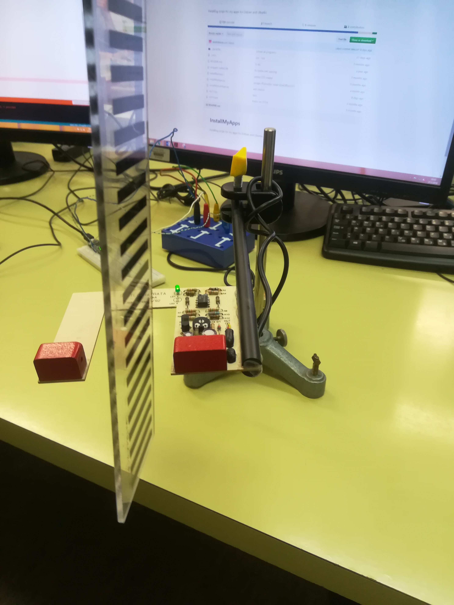

Author: Ana Vrečar,
        Aljaž Mikuš

Date: 2018-03-22 

# Merjenje hitrosti ravnila skozi optièna vrata

> Izmerili bomo hitrost ravnila skozi optièna vrata. Ko "ravnilo" prekine curek v optiènih vratih izmerimo èas. Iz razlik èasov med zaporednima prekinitvama lahko izraèunamo povpreèno hitrost.


## Potrebna oprema:
- ravnilo
- optièna vrata
- stojalo
- žice 3x
- vezavna plošèa
- nano arduino
- Usb kabel

## Navodila in uporaba

Nano arduino prikljuèimo na vezavno plošèo. Optièna vrata pritrdimo v stojalo. GND prikluèek (èrn) vežemo na GND prikljuèek na nano arduinu. VCC prikljuèek za napetost (rdeè) vežemo na +5V prikljuèek na arduinu. Signalni kabel (zelen) vežemo na A0 prikljuèek na arduinu. 

| Arduino prikljuèek  | senzor prikljuèek |
|:-------------------:|:-----------------:|
| +5V                 | VCC               |
| GND                 | GND               |
| A0                  | Signal            |

Kako naj uèitelj izvede meritev?

Uèitelj zažene program arduino. Odpre COM3 okno za izpis podatkov. Skozi optièna vrata spusti ravnilo. Izmerjeni in izraèunani podatki se izpišejo na zaslonu.



## Program


```c++
long dt[30];

void setup() {
  // put your setup code here, to run once:
  pinMode(14, INPUT); 
  Serial.begin(115200); 
  Serial.print(digitalRead(14));
}
```
Z zgornjo kodo smo nastavili vhod na katerem odèitujemo meritve ter hitrost izvajanja meritev.
```c++
void loop() {
  // put your main code here, to run repeatedly:
  int stanje_vhoda = 0;
  int i = 0;
  stanje_vhoda = digitalRead(14);

  for (int n = 0; n < 20; n++) { \\izberemeo število meritev (10).
    while (digitalRead(14) == 0) {
      //èakamo... dva enaèaja -> primerja, en enaèaj -> definiraš --- prozorna
    }

    long t1 = micros();
    //delay(0.1);  //zakasnitev, da dobimo ustreznejše rezultate - odstranimo nepravilnosti iz okolice

    while (digitalRead(14) == 1) {
      // èakamo, da sprostimo snop ---- èrna
    }
    //delay(0.1);  //zakasnitev, da dobimo ustreznejše rezultate - odstranimo nepravilnosti iz okolice

    while (digitalRead(14) == 0) {
      // ---- prozorna 2.
    }
    long t2 = micros();
    //delay(0.1);
    dt[n] = t2 - t1;
  }
```
Z zgornjo kodo smo definirali število in izpis meritev èasa.
```c++
   for (int n = 0; n < 10; n++) {
    Serial.print(dt[n]);
    Serial.print(" ");
    float v = 10000.0 / dt[n] ;
    Serial.print(v);
    Serial.println("m/s");
    }
    delay(10000);
}
```
Z zgornjo kodo smo definirali izraèun in izpis hitrosti.
