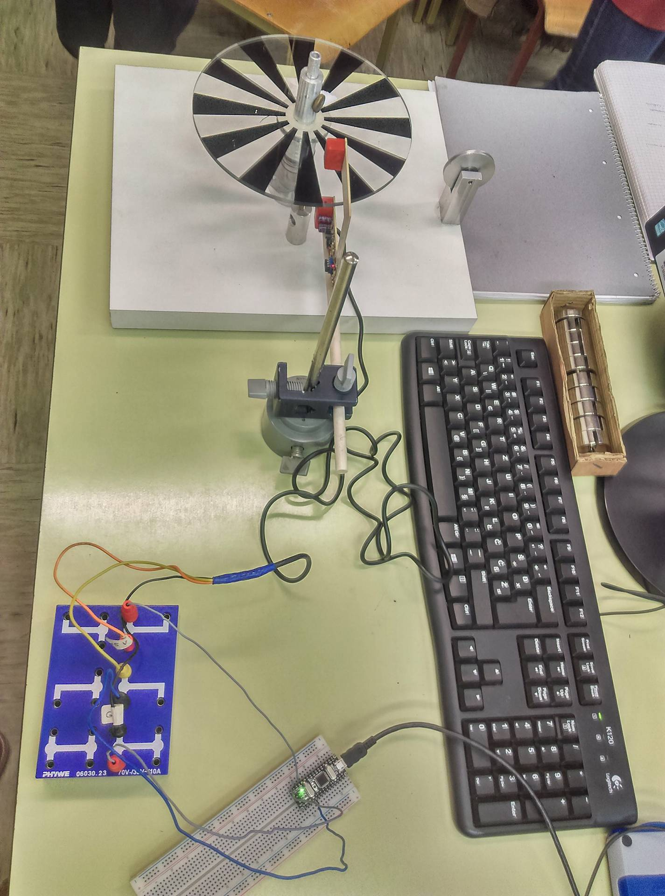

Author: Miha Žarn, Aleš Pršin

Date: 2018-03-22 

# Kotna hitrost vrtljive plošèe

S pomoèjo mikrokrmilnika Arduino nano bomo izmerili kotno hitrost plošèe, ki se vrti okoli svoje osi. 

##  Potrebna oprema

Za meritev potrebujemo mikrokrmilnik Arduino nano, svetlobna vrata, raèunalnik in uteži. Koda, ki jo vnesemo v program prilagava spodaj. 
+ Arduino nano ali uno [link](https://www.aliexpress.com/item/Nano-CH340-ATmega328P-MicroUSB-Compatible-for-Arduino-Nano-V3/32572612009.html)

## Navodila in uporaba

Mikrokrmilnik Arduino nano prikljuèimo na raèunalnik. Na sam Arduino pa vežemo svetlobna vrata, tako kot je zapisano v spodnji tabeli.
Pri prikljuèku za signal lahko uporabimo katerikoli pin za digitalni vhod.

| Arduino prikljuèek  | senzor prikljuèek |
|:-------------------:|:-----------------:|
| +5V                 | VCC               |
| GND                 | GND               |
| D2                  | Signal            |

Meritev izvajamo tado, da med svetlobna vrata postavimo vrtljivo plošèo s temnimi in prozornimi progami.
Vrvico navijemo okoli vrteèega podstavka. Na konec vrvi obesimo uteži in jo spustimo, da prosto pada.
Pred tem zaženemo program, s katerim sprogramiramo mikrokrmilnik Arduino nano.



## Program

S spodnjo kodo definiramo digitalni vhod, na katerega se bomo sklicevali skozi kodo.
```c++
#define vhodni_pin 2
```

Spodnja koda nam deklarira spremenljivko za izraèun kotne hitrosti
```c++
float kotna_hitrost;
```
V naslednji kodi imamo funkcijo setup(), v kateri nastavimo digitalni vhod in vkljuèimo serijski vmesnik.
```c++
void setup() {                                  
   pinMode(vhodni_pin, INPUT);                   
  Serial.begin(9600);                           
  Serial.println("Spodaj se bodo izpisovale vrednosti kotne hitrosti v °/s");
}
```

Z naslednjo kodo ustvarimo zanko, ki bo merila èas med prvim prehodom med prozorno in èrno liso na vrtljivi plošèi
in drugim prehodom med prozorno in èrno liso. Na koncu kode je še enaèba za kotno hitrost in ukaz, ki izpisuje
vrednosti kotnih hitrosti.
```c++
void loop() {                                           
    int stanje_vhoda = 0;                      
  stanje_vhoda = digitalRead(vhodni_pin);

  while (digitalRead(vhodni_pin) == 0) {  
    }
  long t1 = millis();                         

  while (digitalRead(vhodni_pin) == 1) {  
     }

  while (digitalRead(vhodni_pin) == 0) { 
      }
  long t2 = millis();                           
     
  long dt =t2 - t1;

  kotna_hitrost = 360.0/12/dt*1000;            
    Serial.println(kotna_hitrost);
}
```


