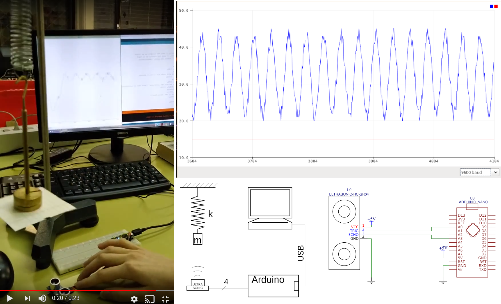

Author: Nejc Mežnar, Sandra Palcich

Date: 2018-03-22 

# Vzmetno nihalo

## Opis

Namen tega projekta je prikazati, kako se spreminja lega vzmetnega nihala v odvisnosti od èasa. Vzmetno nihalo sestavimo iz stojala, vzmeti in uteži. Za meritev pa potrebujemo še mikrokrmilnik Arduino Nano in pa ultrazvoèni senzor.


## Potrebna oprema


Na tem mestu naštejte katere potrebšèine bi uèitelj potreboval in jih naštejte (uporabljalte znake kot so: *, - ali +):
+ Arduino nano ali uno [link](https://www.aliexpress.com/item/Nano-CH340-ATmega328P-MicroUSB-Compatible-for-Arduino-Nano-V3/32572612009.html)
+ ultrazvoèni senzor HC-SR04[link](https://www.aliexpress.com/item/Free-shipping-1pcs-Ultrasonic-Module-HC-SR04-Distance-Measuring-Transducer-Sensor-for-Arduino-Samples-Best-prices/690139020.html)

## Navodila in uporaba

V spodnji tabeli so navodila, kako senzor pravilno povežete z mikrokrmilnikom:

| Arduino prikljuèek  | senzor prikljuèek |
|:-------------------:|:-----------------:|
| +5V                 | VCC               |
| GND                 | GND               |
| A0                  | Trig              |
| A3                  | Echo              |


Senzor položimo na mizo, tako da utež niha toèno nad njim. Lahko se zgodi, da utež nima povsem ravnega dna, kar bi precej zmotilo meritev. Zato je pametno, da poveèamo površino spodnje ploskve uteži. To lahko storimo povsem preprosto. Na dno uteži pritrdimo košèek papirja oz. kartona. Èe navodila niso dovolj jasna, sva priložila še spodnjo fotografijo, ki bo razjasnila vse dvome.




Prilagava še povezavo do posnetka poskusa. 
https://www.youtube.com/watch?v=ILUGC_e2j5Q&feature=youtu.be 

## Program

Programu povemo, s katerimi vrati bomo delali. Nato definiramo spremenljivke, v našem primeru je dovolj, èe jih definiramo kot cela števila, saj razdaljo merimo v mm.
```c++
const int trigPin = 14;
const int echoPin = 17;

// Definiramo spremenljivke.
long duration;
int distance;
```
Definiramo, katera vrata so vhod in katera izhod, nato pa že lahko priènemo s komunikacijo.
```c++
void setup() {
pinMode(trigPin, OUTPUT); // Nastavimo trigPin kot izhod.
pinMode(echoPin, INPUT); // Nastavimo echoPin kot vhod.
Serial.begin(9600); // Priène s komunikacijo.
}
```
Kljuèni del programa, ki doloèa, kako si stopnje sledijo in koliko èasa traja vsaka. Program tudi poskrbi, da zakasnitev zaradi komunikacije ne vpliva na komuniciranje.
Najprej poskrbimo, da je zvoènik res ugasnjen, poèakamo dve mikrosekundi. Nato ga prižgemo za 5 mikrosekund in poèakamo, da mikrofon zazna odbiti ultrazvok. Definiramo èas potovanja kot èas, ki poteèe med trenutkom, ko zvok oddamo in trenutkom, ko zvok sprejmemo.
```c++
void loop() {
// Pripravi trigPin.
digitalWrite(trigPin, LOW);
delayMicroseconds(2);
// Nastavi trigPin na logièno 'enko' za 5 mikro sekund. Zvoènik oddaja zvok 5 mikrosekund, nato se ugasne.
digitalWrite(trigPin, HIGH);
delayMicroseconds(5);
digitalWrite(trigPin, LOW);
// Odèita echoPin , vrne èas potovanja zvoènega signala (v mikrosekundah).
duration = pulseIn(echoPin, HIGH);
```
Za izraèun prepotovane razdalje potrebujemo še hitrost zvoka v zraku in uredimo enote, da dobimo rezultat v milimetrih. Razdaljo razpolovimo, saj je zvok potoval do ovire in nazaj. Razdaljo še izpišemo na vmesniku.
```c++
// Izraèun prepotovane razdalje.
distance= duration*0.034/2;
// Izpiše razdaljo na uporabniškem vmesniku.
Serial.println(distance);
}
```

## Graf

Didaktièno priporoèljivo pa je meritvi dodati še graf. To naredimo s klikom na "Orodja" v orodni vrstici, nato pa izbere 'Serial plotter'. Lahko zgolj pritisnemo 'ctrl' + 'shift' + 'L'

## V izdelavi...

Program bi lahko nadgradili z meritvijo hitrosti in pospeška uteži, vendar tega najina naloga ne zajemala, zato vas izzivama, da te izraèune sami dodate.
