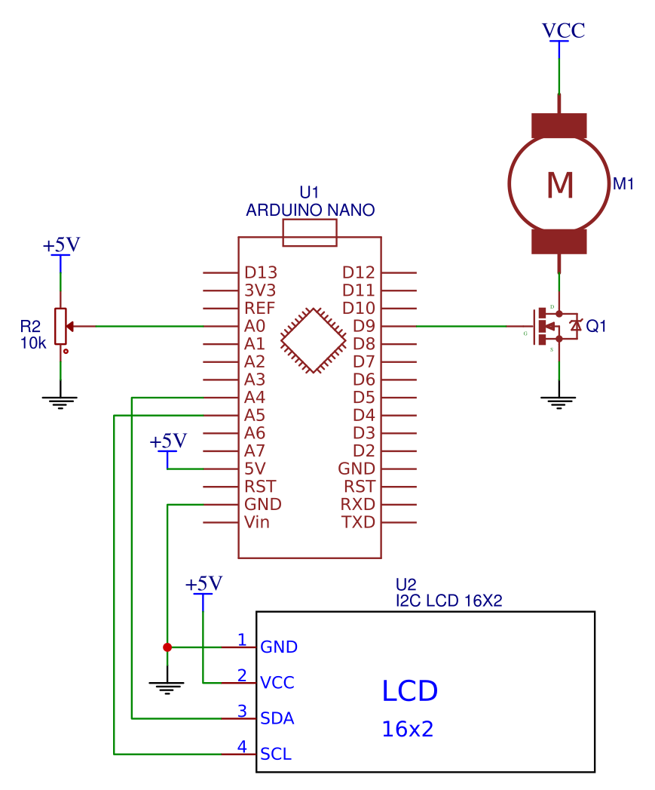
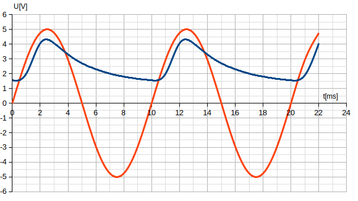

Autorja:
	- Ime in Priimek
	- Ime in Priimek

Datum:
	2018-03-22

# Naslov merilnega sistema

Kratek opis sistema, kaj je njegova naloga in namen. Opišite tudi kje in kako ga lahko uporabimo v šoli in kakšne so njegove omejitve.

## Potrebna oprema
	- Arduino nano
	- elektonski elementi
	- senzorji
	- če predlagate spletni nalup
		* ga podajte kot [link](200~https://store.arduino.cc/grove-pir-motion-sensor)

## Navodila za sestavo merilnega sistema

Navodila naj bodo kratka in jasna. Pogosto kakšna slika več res ni odveč. Vsekakor dokumentirajte vezje kot se to spodobi innarišite vezje v nekem orodju ta risanje vezij:
	- Fritzing ali bolje
	- EasyEDA

Primer vezja:
{height=5.0cm}

Priporočljivo je dodati k opisu tudi tabelo kako smo povezali priključke:

| Arduino priključek  | senzor priključek |
|:-------------------:|:-----------------:|
| +5V                 | VCC               |
| GND                 | GND               |
| A0                  | Trig              |
| A3                  | Echo              |

... in dodati še sliko končnega izdelka.

{height=5.0cm}

## Program

Najprej na kratko opišite kako boste razdelali program... naprimer, da smo ga razčlenili v več funkcij:

- setup()
- loop()
- vzorcenje()
- povprecje()
- izracun() in
- izpis_vrednosti()

Nato pa vsako izmed njih bolj detajlno opišemo... 

```cpp
void setup() { 
Serial.begin(9600); 
}
```
... in opis naslednje kode programa kaj je njen namen...

```cpp
void vzorcenje(){
	for(int i=0;i<10;i++){ 
		buf[i]=analogRead(analogInPin);
		delay(10);
	}
}
```
... nato še nekaj kode ...

```cpp
void izracun_vrednosti(){
	float pHVol=(float)avgValue*5.0/1024;
	float phValue = -5.70 * pHVol + 21.34;
}
```
... itn ...

# Pričakovani rezultati in meritve

Za konec postrezite bralcu še z rezultati. Predstavite jih lahko v tabeli ali še bolje, da narišete graf in sliko grafa vstavite v poročilo.


